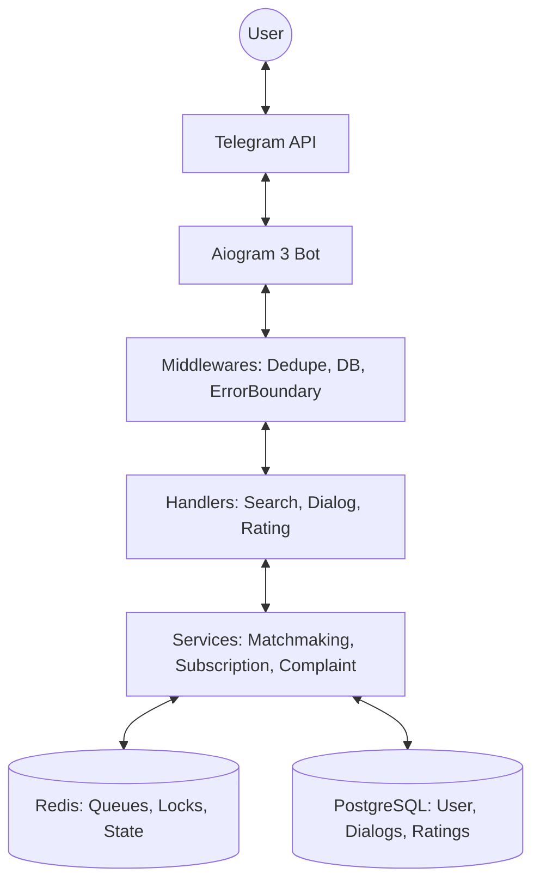

# 🤖 Anonymous Telegram Chat Bot (Enterprise Edition)

A world-class, anonymous matchmaking Telegram bot built with stability, scalability, and security in mind. This is not just a bot; it's a battle-tested infrastructure for real-time human interaction.

## ✨ WOW Features

### 🛡️ Never-Dies Reliability (Safe API)
*   **Zero-Crash Telegram API Wrappers:** Every call to Telegram is wrapped in a safety layer that handles `RetryAfter` (flood limits), `Forbidden` (user blocked bot), and `BadRequest` automatically.
*   **Markdown Hardening:** Automatic fallback and escaping for Markdown entities. If a user's name or message contains symbols that break Telegram's parser, the bot handles it gracefully without crashing.
*   **Global Error Boundary:** A custom middleware that catches any unhandled exception, logs it with a traceback, and sends an alert to a dedicated admin channel.

### 🎭 Smart Matchmaking
*   **Priority Queuing:** Supports both Global and City-based queues.
*   **Premium Boost:** Premium users get prioritized matching and exclusive filters (matching with high-rated users only).
*   **Atomic Matchmaking (LUA):** Matchmaking logic is implemented as a Redis LUA script to ensure absolute atomicity and zero race conditions under high load.

### ⚡ UX & Anti-Abuse
*   **Single-Message UI:** The bot maintains a clean chat by editing or replacing exactly one control message. No more message-spam from the bot.
*   **Double-Click Protection:** Redis-based deduplication middleware prevents double-tapping inline buttons or sending duplicate commands during lag.
*   **Sophisticated Rating System:** Anti-abuse logic for ratings (seasonal validity, pair-frequency checks) and immediate admin alerts for sharp rating drops.

### 🛠️ Admin & Audit
*   **Admin Alerts Channel:** Real-time notifications for complaints, sharp rating changes, and premium purchases.
*   **Full Dump Commands:** View user profiles, dialogue histories, and manage premium status directly from the Telegram alerts channel.
*   **Rich Logging:** Structured logging with rotation and correlation IDs.

---

## 🏗️ Architecture

---

## 🚀 Quick Start (Deployment)

### Local Development (Docker)
1.  Copy `.env.example` to `.env` and fill in your `BOT_TOKEN`.
2.  Run `docker compose up -d --build`.
3.  The bot is now running with automatic database migrations (Alembic).

### Deploy to Railway.app (Recommended)
1.  **Prepare:** Push your code to a private or public GitHub repository.
2.  **Create Project:** On [Railway.app](https://railway.app), click **"New Project"** -> **"Deploy from GitHub repo"**.
3.  **Add Database & Redis:** Click **"Add Service"** and add **PostgreSQL** and **Redis** plugins.
4.  **Configure Environment:** In the `bot` service settings, add these variables:
    *   `BOT_TOKEN`: From @BotFather.
    *   `YOOKASSA_SHOP_ID`: Your YooKassa Shop ID.
    *   `YOOKASSA_SECRET_KEY`: Your YooKassa Secret Key (starts with `live_` or `test_`).
    *   `ADMINS`: Your Telegram ID (comma-separated if multiple).
    *   `ALERTS_CHAT_ID`: ID of your private channel for error alerts.
    *   `DB_HOST`, `DB_PORT`, `DB_NAME`, `DB_USER`, `DB_PASSWORD`: Railway will provide these via PostgreSQL plugin references.
    *   `REDIS_HOST`, `REDIS_PORT`: Railway will provide these via Redis plugin references.
5.  **Build:** Railway will automatically build the image using the `Dockerfile` and apply migrations via `entrypoint.sh`.

### Deploy to VPS (Docker)
1.  **Install Docker & Docker Compose** on your server.
2.  **Clone Repo:** `git clone https://github.com/yourusername/yourrepo.git && cd yourrepo`.
3.  **Configure:** `cp .env.example .env` and fill in your production values.
4.  **Run:** `docker compose up -d --build`.

---

## ⚙️ Environment Variables

| Variable | Description |
| :--- | :--- |
| `BOT_TOKEN` | Your Telegram Bot Token from @BotFather |
| `ADMINS` | Comma-separated list of Admin Telegram IDs |
| `ALERTS_CHAT_ID` | Telegram Chat ID for error logs and alerts |
| `YOOKASSA_SHOP_ID` | Your YooKassa Shop ID |
| `YOOKASSA_SECRET_KEY` | Your YooKassa Secret Key |
| `DB_HOST` | PostgreSQL host |
| `DB_PORT` | PostgreSQL port |
| `DB_NAME` | PostgreSQL database name |
| `DB_USER` | PostgreSQL user |
| `DB_PASSWORD` | PostgreSQL password |
| `REDIS_HOST` | Redis host |
| `REDIS_PORT` | Redis port |
| `PAYMENTS_PROVIDER_TOKEN` | Token for Telegram Payments (optional) |

---

## 💎 Tech Stack
*   **Python 3.12**
*   **Aiogram 3.x** (Asynchronous Telegram framework)
*   **SQLAlchemy 2.0** (Async ORM)
*   **Redis** (Queuing & Locks)
*   **Alembic** (Database Migrations)
*   **Pydantic V2** (Settings management)

---

Developed with ❤️ for world-class user experience.
